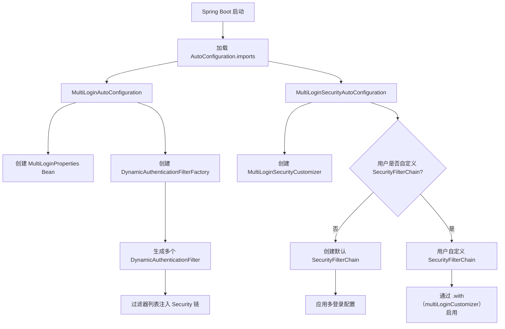
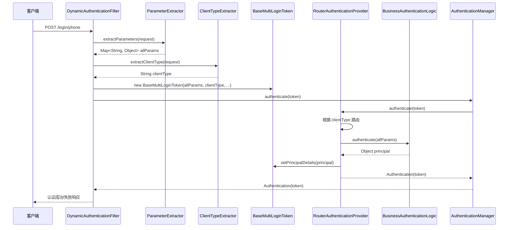

# Multi-Login Spring Security Starter 架构设计文档

## 1. 定位与核心功能 (Overview)

### 一句话说明
这是一个基于 Spring Security 的多方式登录自动配置 Starter，支持多种登录方式（手机号、邮箱、用户名等）和多种客户端类型（用户端、管理端等）的灵活组合。

### 解决的核心痛点
1. **传统 Spring Security 配置复杂**：每个登录方式都需要单独配置过滤器、Provider 和路径
2. **多客户端类型支持困难**：同一登录方式需要根据不同客户端类型（如用户端、管理端）使用不同的业务逻辑
3. **配置分散不统一**：登录参数提取、客户端识别、业务逻辑耦合在一起，难以维护
4. **扩展性差**：新增登录方式需要修改大量 Security 配置代码

### 核心 Feature 列表
- ✅ **零代码自动配置**：只需配置 `multi-login.enabled=true` 即可启用
- ✅ **多登录方式支持**：支持任意数量的登录方式（phone、email、username 等）
- ✅ **多客户端类型路由**：同一登录方式可根据客户端类型路由到不同的业务逻辑
- ✅ **灵活的参数提取**：支持表单参数、JSON 参数等多种提取方式
- ✅ **客户端类型识别**：支持请求头、Cookie、参数等多种识别方式
- ✅ **DSL 风格配置**：与 Spring Security 6+ 的 DSL 风格完美集成
- ✅ **完整的扩展点**：所有核心组件均可自定义替换
- ✅ **配置驱动**：所有行为通过 YAML/Properties 配置控制
- ✅ **向后兼容**：支持旧版本配置方式，平滑升级

## 2. 内部执行流转与架构设计 (Architecture & Flow)

### 启动与自动装配流程



**详细说明**：
1. **条件触发**：当 `multi-login.enabled=true` 时，自动配置生效
2. **配置加载**：`MultiLoginProperties` 加载所有 YAML/Properties 配置
3. **过滤器工厂**：`DynamicAuthenticationFilterFactory` 根据配置创建多个认证过滤器
4. **安全配置**：
   - 如果用户未自定义 `SecurityFilterChain`，自动创建默认配置
   - 如果用户已自定义，通过 `MultiLoginSecurityCustomizer` 集成
5. **过滤器注入**：所有生成的过滤器被注入到 Spring Security 过滤器链中

### 核心执行链路（一次登录请求的完整流转）



**关键流转节点**：
1. **请求匹配**：`AntPathRequestMatcher` 匹配配置的 `process-url`
2. **参数提取**：`ParameterExtractor` 从请求中提取所有参数
3. **客户端识别**：`ClientTypeExtractor` 识别客户端类型
4. **Token 创建**：`BaseMultiLoginToken` 封装认证信息
5. **路由认证**：`RouterAuthenticationProvider` 根据客户端类型路由到对应的 `BusinessAuthenticationLogic`
6. **业务认证**：用户实现的业务逻辑进行实际认证
7. **结果返回**：认证结果通过过滤器链返回

### 核心架构映射关系

整个框架遵循 **"一个登录方式配置 → 一个过滤器 → 一个路由提供者 → 多个业务逻辑"** 的映射模型：

```
┌─────────────────┐     ┌─────────────────────────────┐     ┌─────────────────────────────┐
│ LoginMethodConfig│────▶│ DynamicAuthenticationFilter │────▶│ RouterAuthenticationProvider │
│    (配置层)      │  1:1│       (过滤器层)            │  1:1│       (路由层)              │
└─────────────────┘     └─────────────────────────────┘     └──────────────┬──────────────┘
                                                                           │
                                                                           │ 1:多
                                                                           ▼
                                                              ┌─────────────────────────────┐
                                                              │ BusinessAuthenticationLogic │
                                                              │       (业务逻辑层)          │
                                                              │  • customerPhoneProvider    │
                                                              │  • employeePhoneProvider    │
                                                              │  • adminPhoneProvider       │
                                                              └─────────────────────────────┘
```

**详细映射说明**：
1. **配置 → 过滤器 (1:1)**：每个 `LoginMethodConfig` 对应一个 `DynamicAuthenticationFilter`
2. **过滤器 → 路由提供者 (1:1)**：每个过滤器对应一个 `RouterAuthenticationProvider`
3. **路由提供者 → 业务逻辑 (1:多)**：每个路由提供者可以管理多个 `BusinessAuthenticationLogic`

### 设计模式应用

| 设计模式 | 应用场景 | 核心类名 |
|---------|---------|---------|
| **策略模式** | 参数提取策略 | `ParameterExtractor` 接口 + `FormParameterExtractor`、`JsonParameterExtractor` 实现 |
| **策略模式** | 客户端类型识别策略 | `ClientTypeExtractor` 接口 + `HeaderClientTypeExtractor` 实现 |
| **策略模式** | 业务认证逻辑策略 | `BusinessAuthenticationLogic` 接口（用户实现） |
| **工厂模式** | 动态创建认证过滤器 | `DynamicAuthenticationFilterFactory` |
| **模板方法模式** | 参数提取模板 | `AbstractInlineParameterExtractor` 抽象类 |
| **责任链模式** | 客户端类型路由 | `RouterAuthenticationProvider` |
| **建造者模式** | Security DSL 配置 | Spring Security 的 `HttpSecurity` |

## 3. 核心组件职责说明

### 3.1 配置层 (Configuration Layer)

**MultiLoginProperties**
- 主配置类，使用 `@ConfigurationProperties(prefix = "multi-login")`
- 负责加载和验证所有 YAML/Properties 配置
- 包含全局配置和登录方式配置映射

**LoginMethodConfig**
- 单个登录方式的详细配置
- 包含路径、参数名、业务逻辑 Bean 等配置

**GlobalConfig**
- 全局共享配置
- 包含客户端类型、处理器、提取器等全局设置

### 3.2 过滤器层 (Filter Layer)

**DynamicAuthenticationFilter**
- 继承 `AbstractAuthenticationProcessingFilter`
- 负责拦截配置的登录路径
- 协调参数提取、客户端识别、Token 创建

**DynamicAuthenticationFilterFactory**
- 工厂类，根据配置创建过滤器实例
- 负责组装所有依赖组件

### 3.3 路由层 (Routing Layer)

**RouterAuthenticationProvider**
- 实现 `AuthenticationProvider` 接口
- 根据客户端类型路由到对应的业务逻辑
- 管理客户端类型与业务逻辑的映射关系

### 3.4 业务逻辑层 (Business Logic Layer)

**BusinessAuthenticationLogic**
- 核心业务接口，用户必须实现
- 负责实际的用户认证逻辑
- 返回认证成功后的用户主体信息

### 3.5 提取器层 (Extractor Layer)

**ParameterExtractor**
- 参数提取器接口
- 负责从 HTTP 请求中提取所有认证参数

**ClientTypeExtractor**
- 客户端类型提取器接口
- 负责识别请求的客户端类型

## 4. 扩展点设计

### 4.1 接口设计原则

1. **面向接口编程**：所有核心功能都通过接口暴露
2. **单一职责**：每个接口只负责一个明确的功能
3. **开闭原则**：对扩展开放，对修改关闭
4. **依赖倒置**：高层模块不依赖低层模块，都依赖抽象

### 4.2 扩展点列表

| 扩展点 | 接口/类 | 扩展方式 | 使用场景 |
|--------|---------|----------|----------|
| 业务认证逻辑 | `BusinessAuthenticationLogic` | 实现接口 + Spring Bean | 自定义用户认证逻辑 |
| 参数提取器 | `ParameterExtractor` | 实现接口 + Spring Bean | 支持新的参数格式（如 JWT、XML） |
| 客户端类型提取器 | `ClientTypeExtractor` | 实现接口 + Spring Bean | 新的客户端识别方式（如 IP、设备指纹） |
| 认证处理器 | `AuthenticationSuccessHandler`/`AuthenticationFailureHandler` | 实现接口 + Spring Bean | 自定义认证成功/失败响应 |

### 4.3 扩展机制

**条件装配机制**：
- 使用 `@ConditionalOnMissingBean` 提供默认实现
- 用户可以通过注册同名 Bean 覆盖默认实现
- 配置驱动，通过 Bean 名称引用自定义实现

**配置覆盖机制**：
- 全局配置 → 方法级配置 → 具体实现
- 支持逐级覆盖，提供最大灵活性

## 5. 架构优势与设计考量

### 5.1 架构优势

1. **清晰的层次分离**
   - 配置层：定义做什么
   - 过滤器层：处理 HTTP 交互
   - 路由层：决定怎么做
   - 业务层：实际执行

2. **灵活的扩展能力**
   - 所有核心组件均可替换
   - 支持多种扩展方式（接口实现、Bean 覆盖、配置驱动）
   - 新增功能无需修改框架代码

3. **高效的资源利用**
   - 一个过滤器处理多种客户端类型
   - 按需加载业务逻辑
   - 配置驱动，避免硬编码

4. **易于测试**
   - 各层之间通过接口通信
   - 可以单独测试每个组件
   - 支持 Mock 测试

### 5.2 设计考量

1. **性能考量**
   - 过滤器匹配使用高效的 `AntPathRequestMatcher`
   - 参数提取支持流式处理，避免重复解析
   - 路由映射使用 HashMap，O(1) 时间复杂度

2. **安全性考量**
   - 继承 Spring Security 的安全机制
   - 支持 CSRF、CORS 等安全配置
   - 参数验证和异常处理完善

3. **兼容性考量**
   - 支持 Spring Security 6+ 的 DSL 风格
   - 向后兼容旧版本配置方式
   - 支持多种参数格式（表单、JSON、Header）

4. **可维护性考量**
   - 清晰的代码结构和命名规范
   - 完整的日志记录和错误处理
   - 详细的配置说明和示例

## 6. 相关文档

- [配置文档](../configuration/CONFIGURATION_GUIDE.md) - 详细配置说明和使用示例
- [核心架构映射](../architecture/CORE_ARCHITECTURE_MAPPING.md) - 核心组件映射关系说明
- [升级指南](../upgrade/AUTO_CONFIGURATION_GUIDE.md) - 版本升级和迁移指南
- [配置元数据](../upgrade/CONFIGURATION_METADATA.md) - IDE 智能提示配置说明